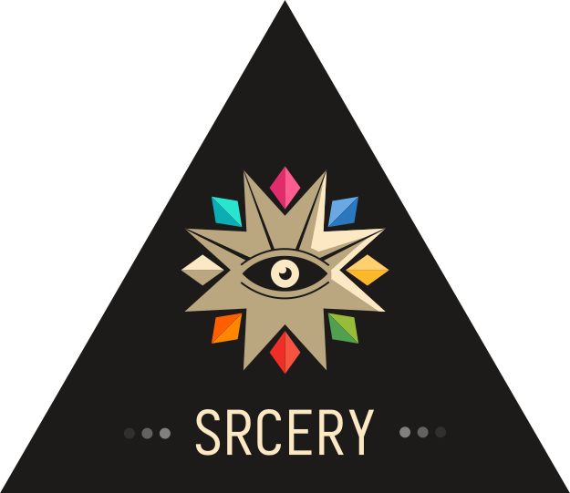
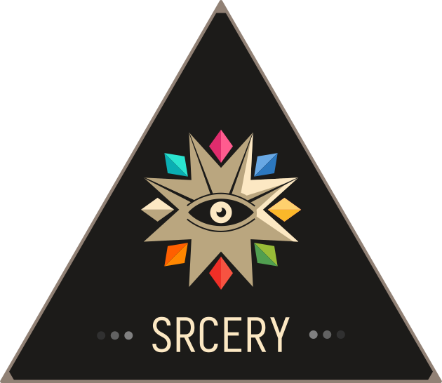
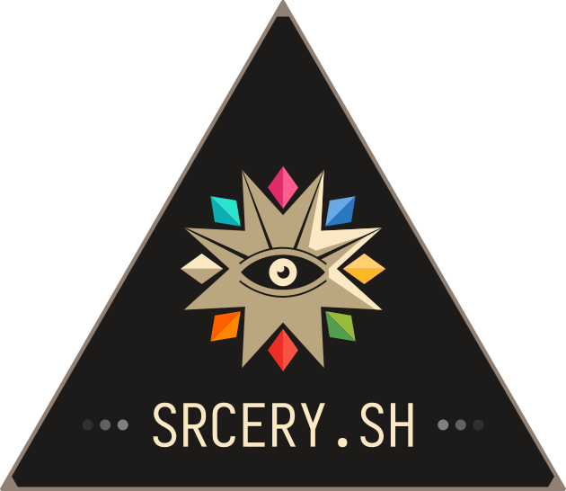
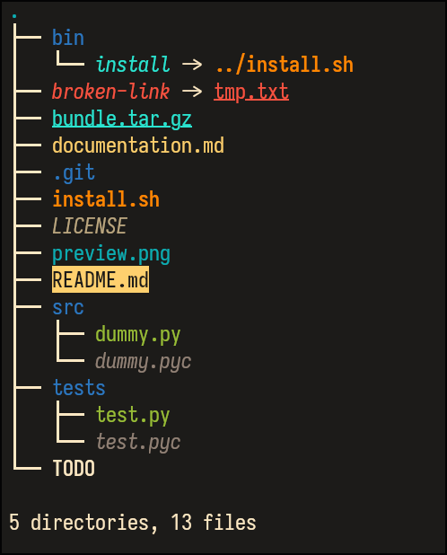

# Srcery asset repository

## Titles & logos

- logo\_circle.svg 
  
- logo.svg 
  
- logo\_border.svg 
  
- logo\_url.svg 
  
- glyph.svg 
    
- favicon.svg 
    
- title.png
  
- terminal\_title.png
  

## Vim
- vim/viml\_bash.png
  

- vim/lisp.png
  

- vim/c\_rust.png
  

- vim/py\_js.png
  

- vim/git\_term.png
  

- vim/lightline.png
  

- vim/airline.png
  

## Emacs

- emacs/lisp.png
  

- emacs/py-js.png
  

- emacs/rs-magit.png
  

- emacs/org-c.png
  

## Vivid

- [vivid/preview.png](vivid/preview.png)

   

## License

 
<a property="dct:title" rel="cc:attributionURL" href="https://github.com/srcery-colors/srcery-assets">Srcery Assets</a> by <a rel="cc:attributionURL dct:creator" property="cc:attributionName" href="https://github.com/srcery-colors">Daniel Berg and srcery-colors contributors</a> is licensed under <a href="https://creativecommons.org/licenses/by/4.0/?ref=chooser-v1" target="_blank" rel="license noopener noreferrer" style="display:inline-block;">CC BY 4.0</a>
 

