# Srcery asset repository

This repository contains static assets used for the various Srcery themes and projects.

## Swatch

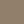

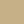
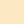

## Logos

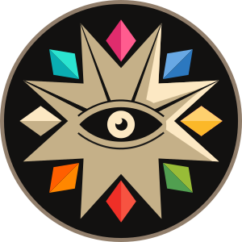


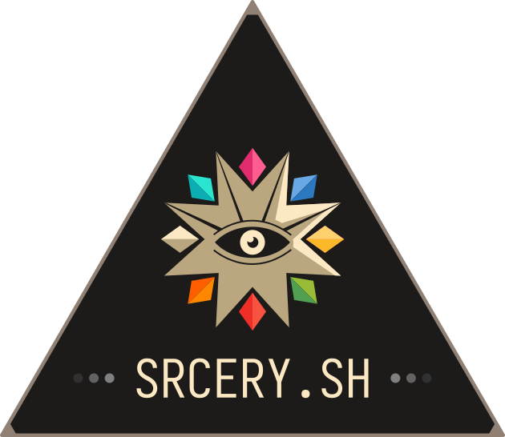
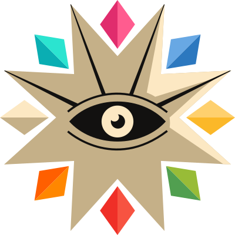

## Web

## Banners

## Vim

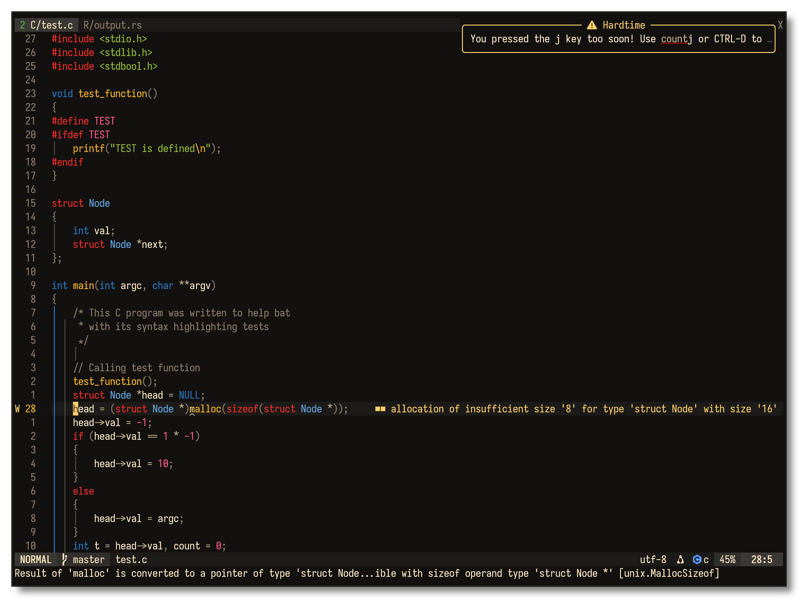
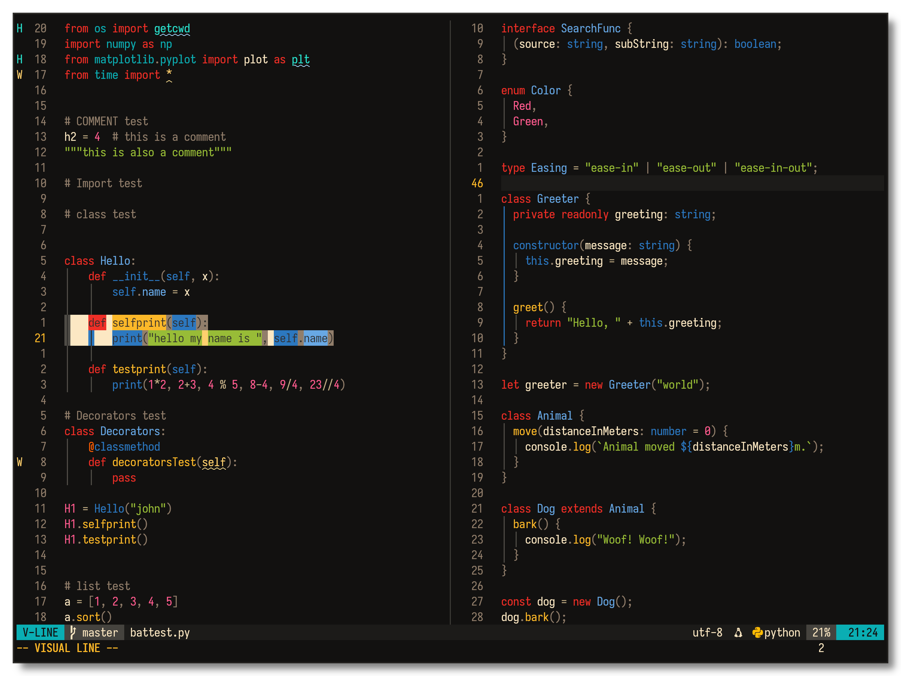
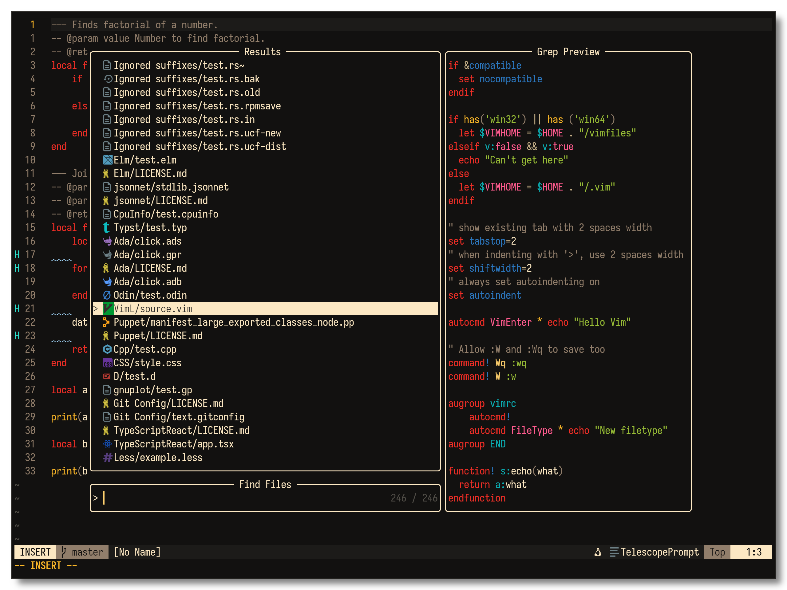
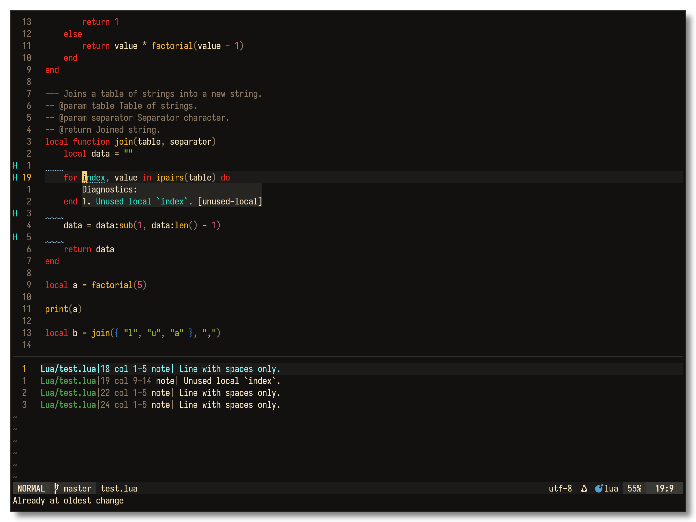
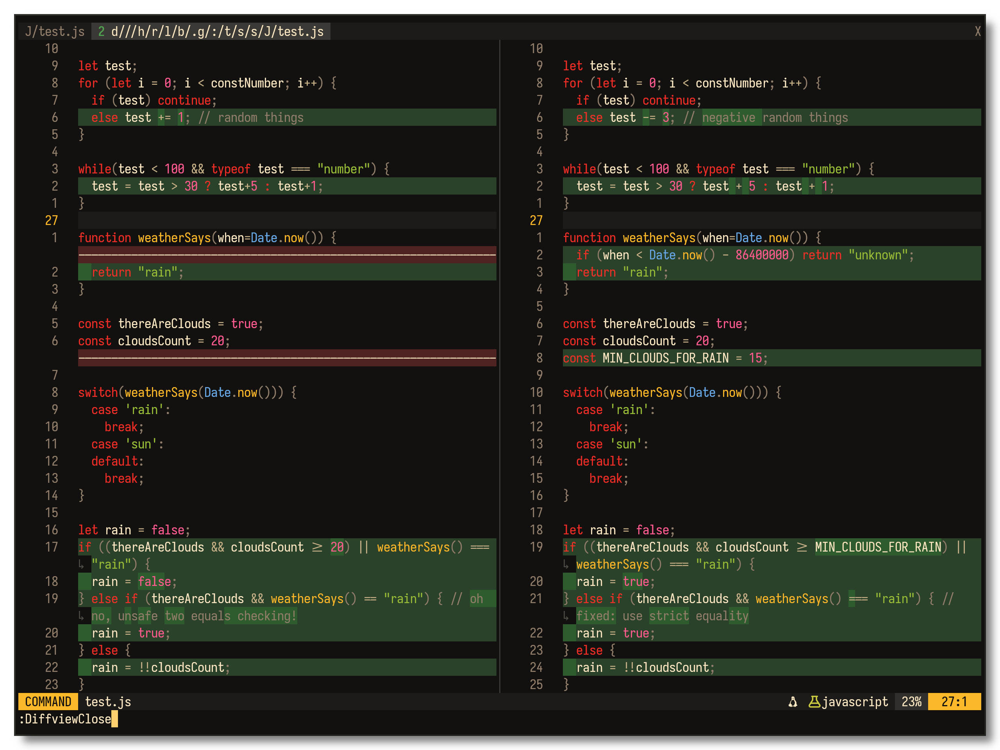
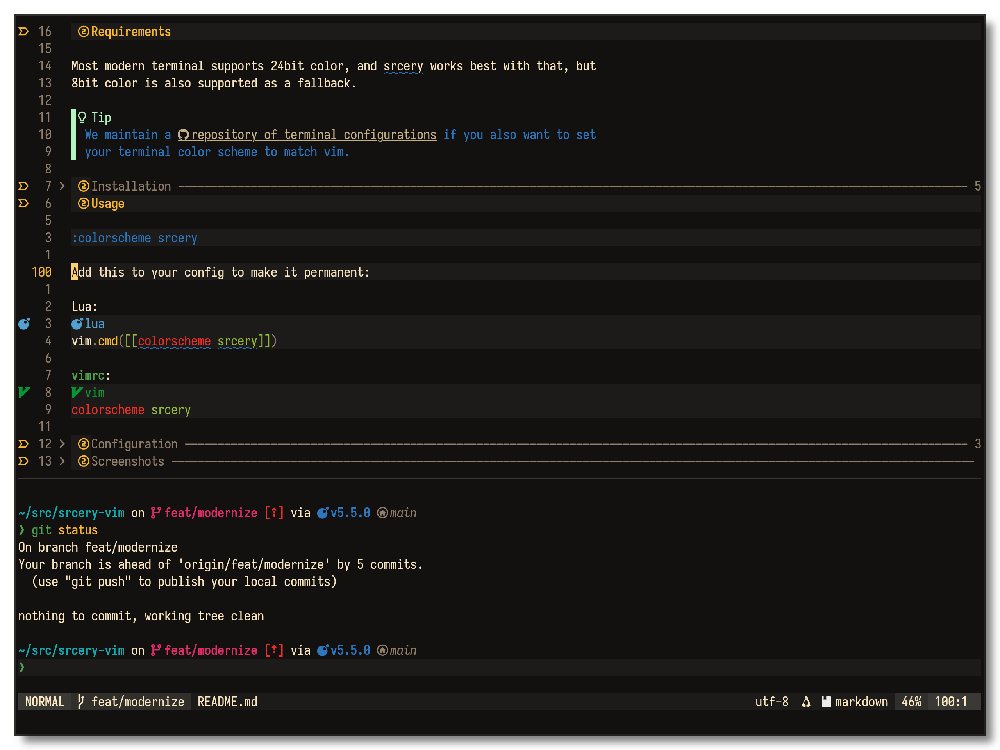

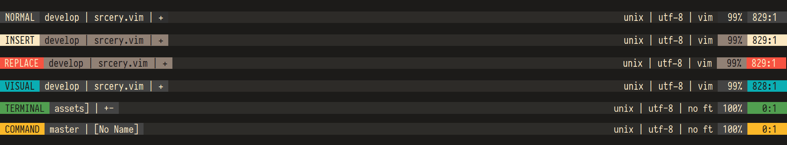
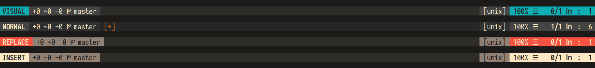

## Emacs

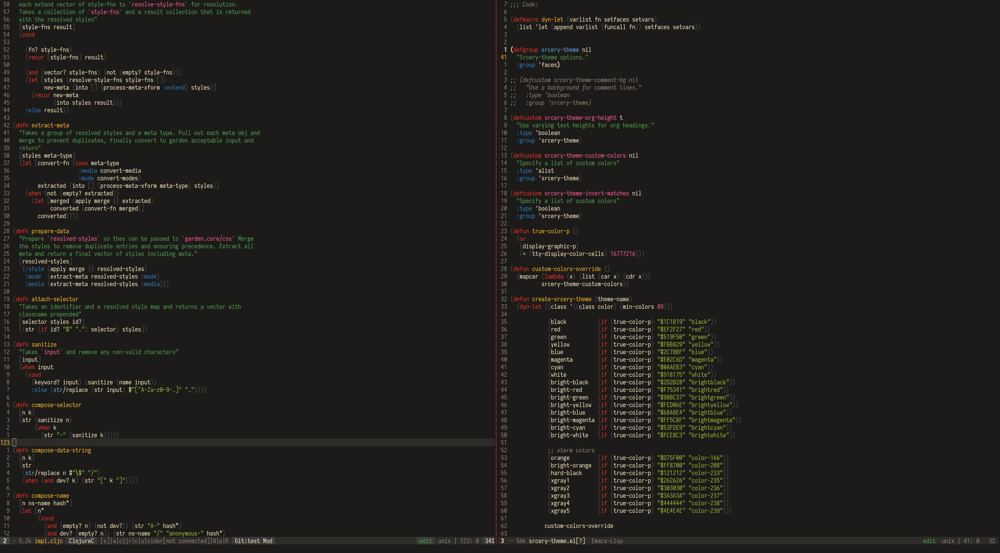
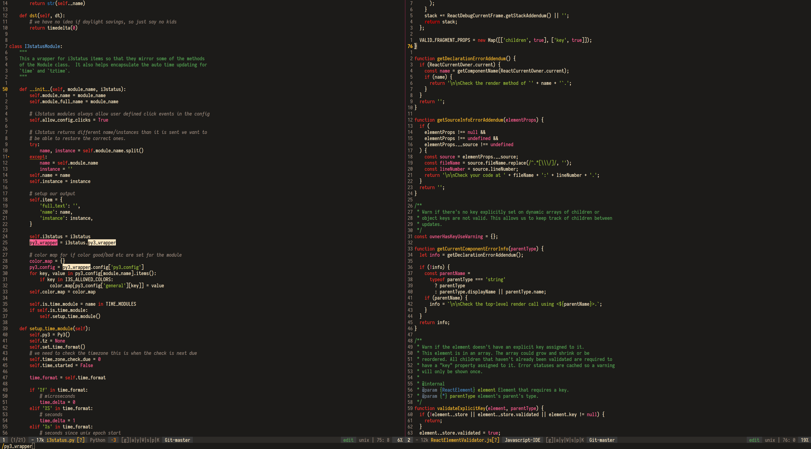
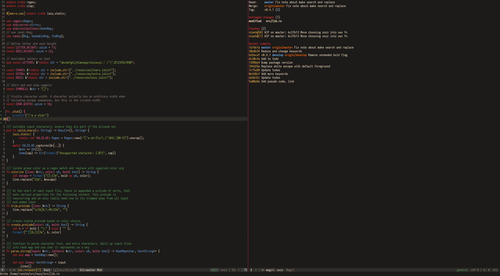
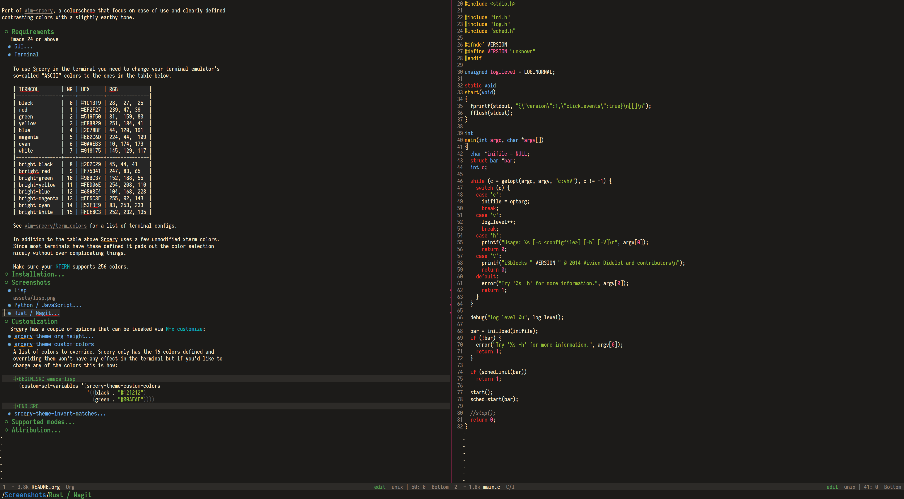

## Vivid

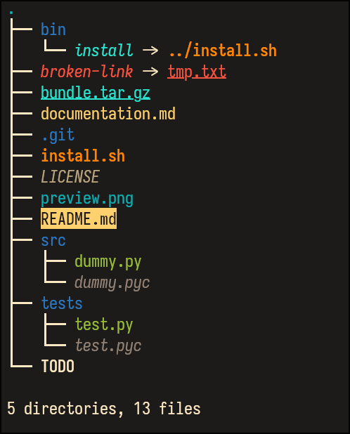

## License

 
<a property="dct:title" rel="cc:attributionURL" href="https://github.com/srcery-colors/srcery-assets">Srcery Assets</a> by <a rel="cc:attributionURL dct:creator" property="cc:attributionName" href="https://github.com/srcery-colors">Daniel Berg and srcery-colors contributors</a> is licensed under <a href="https://creativecommons.org/licenses/by/4.0/?ref=chooser-v1" target="_blank" rel="license noopener noreferrer" style="display:inline-block;">CC BY 4.0</a>
 

